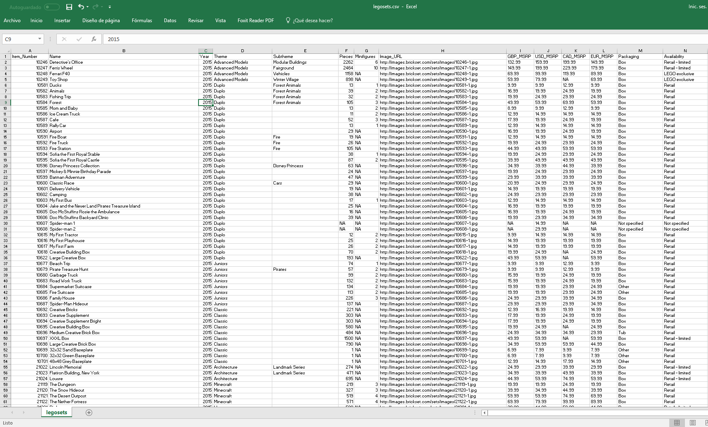

# { data-background="img/data-culture.jpg"}

```{r, include = FALSE}
source("R/setup.R")
```

## Que haremos?

> - Introducción
> - Análsis Exploratorio de Datos (AED)
> - Estadística Descriptiva (ED)
>      * Medidas de Tendencia
>      * Visualización de datos
> - Estudiar Ejemplos
<span class="fragment">, hacer ejemplos</span><span class="fragment">, __equivocarnos__</span><span class="fragment">, __corregirnos__</span><span class="fragment">, vivir ejemplos</span>

# Introducción { .center .white data-background="#F44336"}

## Introducción

```{r, out.height= "350px", echo=FALSE}
knitr::include_graphics("https://visualizacion-uc.github.io/procesamiento-y-analisis-de-datos/clases/img/tidy-data.png")
```

Fuente: R for Data Science, Wickham & Grolemund

## Introducción

Antes de __explicar__ debemos __entender__

<span class="fragment">
El Análisis __Exploratorio__ y la 
Estadística __Descriptiva__ son parte clave 
para el entendimiento</span>

<span class="fragment">
AED y ED van de la mano. AED es el fin y ED una herramienta para 
lograrlo
</span>

<span class="fragment">`r ico("quote-left")` Escuchar lo que los datos nos hablan</span>


## Glosario

> - Una __variable__ es una cantidad, que puede ser medida: estatura, magnitud
de un sismo, velocidad de un huracán, inteligencia (__¿?__)
> - Un __valor__ es un estado de la variable cuando se mide: 1.20 metros, 8° Richter
> - Una __observación__ o __caso__  es un conjunto de mediciones -no de la misma
variable necesariamente- pero si en un mismo instante y a un mismo objeto.

## Glosario

> - __Datos tabulados__ es un conjunto de _valores_ cada uno asociado
a una _variable_ y una _observación_


## Prerequisitos

Antes de partir necesitamos:

- Entusiasmo
- Mantener la mente abierta
- Familiarizado con `ggplot2` y `dplyr`

# Análisis Exploratorio de Datos { .center .white data-background="#3F51B5"}

## Análisis Exploratorio de Datos 

No existe definición formal con reglas a seguir. Es un __estado mental__

- Generar preguntas acerca de los datos
- Buscar respuestas visualizando, transformando los datos
- Hacer nuevas preguntas a partir de lo aprendido

<span class="fragment">__Generar conocimiento__</span>

## AED

Generar conocimiento no solo implica extraer la información que tratan de medir
los datos

<span class="fragment">Este conocimiento puede estar también en conocer si los datos fueron bien medidos o existen algunos registros datos mal registrados</span>

<span class="fragment">__Validar calidad de los datos__</span>

## Visualizando Distribuciones { .right .white data-background-iframe="vis-dis.html" }

## Distribución

Distribución se relaciona a la forma que varían los datos de medición en 
medición

<span class="fragment">Estudiando la forma de como se distribuyen los datos podemos ver
cuales son los más comunes, o ver si exsiten casos raros<span>

<span class="fragment">Y variará principalmente del tipo de variable analizada:
__categórica__ o __continua__</span>

## Dataset Legos { .left .white    data-background="http://media-cdn.timesfreepress.com/img/photos/2016/07/25/1469464845_0727MfeatLibrary1-C_t1070_h5be62d5b4b340aded4d6baf5bd671ee4fd6571f4.jpg" }

## Leyendo datos

```{r}
library(tidyverse)

legos <- read_csv("https://raw.githubusercontent.com/seankross/lego/master/data-tidy/legosets.csv")
# primer paso! paso #1
glimpse(legos)
```

## Explorando Variables Discretas

¿Cuántos temas hay?

```{r}
legos %>% count(Theme, sort = TRUE)
```

## Explorando Variables Discretas

¿Cuántos temas hay?

```{r}
ggplot(legos) +
  geom_bar(aes(Theme))
```

## Explorando Variables Discretas

¿Cuántos temas hay?

```{r}
library(forcats)
legos <- mutate(legos, Theme2 = fct_lump(Theme, n = 5))
ggplot(legos) + geom_bar(aes(Theme2))
```

## Explorando Variables Discretas

¿Cuáles son los tipos de envoltorio?

```{r}
legos %>% count(Packaging, sort = TRUE)
```

## Explorando Variables Discretas

¿Cuáles son los tipos de envoltorio?

```{r}
ggplot(legos) +
  geom_bar(aes(Packaging))
```

## Explorando Variables Discretas

¿Y esas etiquetas? 


## Explorando Variables Discretas

¿Y esas etiquetas? 

```{r}
ggplot(legos) +
  geom_bar(aes(Packaging)) +
  coord_flip() # rotar :D
```

## Explorando Variables Discretas

¿Y esas etiquetas? 

```{r}
legos <- mutate(legos, Packaging = fct_infreq(Packaging)) # ordenar
ggplot(legos) +
  geom_bar(aes(Packaging)) + coord_flip() # rotar :D
```

## Explorando Variables Continuas

¿Desde cuándo se _tenemos registros_ de sets de legos?*

```{r}
ggplot(legos) +
  geom_bar(aes(Year))
```

## Explorando Variables Continuas

¿Cuántas piezas traen los sets?

```{r}
ggplot(legos) +
  geom_histogram(aes(Pieces))
```

## Explorando Variables Continuas

¿Cuántas piezas traen los sets?

```{r}
legos <- mutate(legos, Pieces2 = ifelse(Pieces > 1000, 1000, Pieces))
ggplot(legos) + geom_histogram(aes(Pieces2))
```


## Explorando Variables Continuas

¿Cuántas minifuguras traen los sets?

```{r}
ggplot(legos) +
  geom_histogram(aes(Minifigures))
```

## Valores comunes, valores raros

¿Cuántos sets traen más de 25 figuras? ¿Cuáles son?

```{r}
legos %>% 
  filter(Minifigures > 25) %>% 
  select(Name, Year, Theme, Minifigures)
```

## Al infinito y más allá


# Estadística Descriptiva { .center .white data-background="#4CAF50"}

## Estadística Descriptiva

Conjunto de procedimientos para __resumir__ datos

- Medidas de tendencia central y dispersión<span class="fragment">. No solo basta con ver que valores puede tomar una variable<span>
- Visualización de datos<span class="fragment">. Distintos gráficos nos cuentan diferente información acerca de la variable(s)<span>

<span class="fragment">__Sintetizar información__<span>

## Motivación

>- Te mandan un _inocente_ archivo
>- Mientras te piden que encuentres información relevante (para ayer)
>- Te pieden que describas el contenido 
>- Y obtengas información relevante
>- Claramente nunca habías visto este tipo de información

## Motivación

Lo abres y 

<span class="fragment">

<span>

## Glosario

Tipos de Variables

> - Categórica
>      * Nominal. Especie: perro, gato
>      * Ordinal. Satistacción bueno, malo, ...
> - Cuantitativa
>      * Discreta. # hijos: 0, 1, 2, ...
>      * Continua. Peso; 3.54, 5.45

## Medidas de Tendencia y Dispersión

Son indicadores (generalmente un número) obtenidos de los datos 
que __resumen__ información y nos hablan de alguna característica de 
la __distribución__ de la variable

<span class="fragment">Nos ayudan a tener una idea más fina en __donde se concentran__
las variables y que __tan concentrados__ están los valores</span>

## Medidas de Tendencia Central

Nos señalan el valor en _torno al cual se concentran los datos_

>- __Media__ o __Promedio__: La suma de los datos dividido por la cantidad de los mismos
>- Mediana: Es el valor que está al medio cuando los datos se ordenan
>- Moda: Es el valor que más se repite. Este se usa cuando la variable es _discreta_

## Medidas de Dispersión

Son valores que nos describen la dispersión de los datos. Es decir, __que tan concentrados__ están:

>- __Desviación estándar__: Mide el grado de dispersión en torno a la media
>- Rango: Es el tamaño del intervalo que cubren los datos, el mayor valor menos el mínimo

## Ejemplo equipos

## DataSaurus { .white .right data-background="img/datasaurus.jpg"}

## DataSaurus

```{r}
# install.packages("datasauRus")
library(datasauRus)

datasaurus_dozen
```

## DataSaurus

```{r}
datasaurus_dozen %>% 
  count(dataset)

d1 <- datasaurus_dozen %>% filter(dataset == "away")
d2 <- datasaurus_dozen %>% filter(dataset == "dino")
```

## DataSaurus

```{r}
glimpse(d1)

d1 %>% 
  summarise(
    x_mean = mean(x),
    y_mean = mean(y),
    x_sd = sd(x),
    y_sd = sd(y),
    xy_corr = cor(x, y)
  )
```

## DataSaurus

```{r}
glimpse(d2)

d2 %>% 
  summarise(
    x_mean = mean(x),
    y_mean = mean(y),
    x_sd = sd(x),
    y_sd = sd(y),
    xy_corr = cor(x, y)
  )
```


## Visualización de datos { .left data-background="http://www.wordstream.com/images/data-visualization-tools-concept.png"}

## Visualización de datos

Se refiere a la representación gráfica de los datos __codificando la información__ como: posición, tamaño, formas, colores


----

```{r, echo=FALSE, fig.width=8, fig.height=6}
ggplot(legos) + 
  geom_point(aes(Pieces, USD_MSRP, size = Minifigures, color = Year), alpha = 0.7) +
  scale_color_viridis(option = "A") + 
  scale_y_sqrt(name = "Precio USD", labels = dollar, limits = c(0, 300)) +
  scale_x_sqrt(name = "Piezas", labels = comma, limits = c(0, 2000)) 
```


----

```{r, echo=FALSE, fig.width=8, fig.height=6}
data(gapminder, package = "gapminder")

gapminder %>% 
  group_by(country) %>% 
  filter(row_number() == n()) %>% 
  ungroup() %>% 
  ggplot() + 
  geom_point(aes(lifeExp, gdpPercap, size = pop, color = continent), alpha = 0.7) +
  scale_color_viridis(option = "D", discrete = TRUE) + 
  scale_y_sqrt(name = "GDP per Capita", labels = comma, limits = c(NA, NA)) +
  scale_x_continuous(name = "Esperanza de vida", labels = comma, limits = c(NA, NA)) +
  scale_size(labels = comma, range = c(3, 10), breaks = c(100, 1000, 2000)*1e6)
```

----

```{r, echo=FALSE, fig.width=8, fig.height=6}
# install.packages(c("rgexf", "ggnetwork", "intergraph"))
# 316
library(igraph)
library(rgexf)
library(stringr)
library(ggnetwork)
library(ggrepel)

net <- "http://media.moviegalaxies.com/gexf/92.gexf" %>% 
  read_lines() %>% 
  read.gexf() %>% 
  gexf.to.igraph()

V(net)$name <- str_to_title(V(net)$name)
V(net)$label <- V(net)$name %>% 
  str_extract_all("^\\w{2}| \\w") %>% 
  map_chr(function(x) {
    x %>% unlist() %>% str_c(collapse = "")
  })
V(net)$size <- page.rank(net)$vector
cl <- cluster_fast_greedy(net)
V(net)$comm <- membership(cl)
V(net)$color <- colorize(V(net)$comm)

# head(ggnetwork(net))
set.seed(123)
ggnet <- ggnetwork(net)
dfnet2 <- ggnet %>%
  as.matrix() %>%
  as.data.frame() %>%
  tbl_df() %>%
  select(x, y, vertex.names, weight, size) %>%
  mutate_all(as.character) %>%
  mutate_at(vars(x, y, weight, size), as.numeric) %>%
  filter(is.na(weight))

ggplot(ggnet) + 
  geom_edges(aes(x, y, size = width, color = factor(comm),
           xend = xend, yend = yend), color = "gray", size = 1, alpha = 0.3) +
  geom_point(aes(x, y, size = size, color = factor(comm))) +
  geom_text_repel(aes(x, y, label = vertex.names, size = size),
                  data = dfnet2, color = "#666666",
                  family = "Roboto Condensed") +
  scale_color_viridis(discrete = TRUE) + 
  theme_blank() +
  labs(size = "Pagerank", color = "Comunidad")
```


## Visualización de datos

Existen muchos tipos de gráficos, y su uso dependerá:

>- Tipo de variable
>- Información que quiero extraer 

<span class="fragment">No todos los gráficos tiene ek mismo __objetivo__. Ni
tampoco comparten siempre la dificultad para ser __interpretados__</span>

## Visualizando Variables Categóricas

pie vs bar

treemap

## Visualizando Variables Numéricas

histograma 
link

boxplot violin, swarm, hist,

## Visualizando Variables Categóricas x 2

heatmap
treemap nested

## Visualizando Variables Numéricas x 2

scatter

## Visualizando Numéricas y Categóricas

scatter
facet boxplot violin, swarm, hist, 

## Menciones Honrosas (menos estándar)

## Lollipop


Fuente: http://uc-r.github.io/lollipop

## Joyploy

# Ejercicio I { .center .white data-background="#03A9F4"}

Dada la 

## Datos

seismic monitor data api
https://earthquake.usgs.gov/fdsnws/event/1/

## Datos

```{r, cache=TRUE}
library(tidyverse)

data <- read_delim("https://earthquake.usgs.gov/fdsnws/event/1/query?starttime=2017-09-01&endtime=2017-09-31&format=text", delim = "|")
glimpse(data)
```

# Metainfo & Créditos { .center .white data-background="#FF5722"}

<small>
>- Imágen Lego Arto Alanenpaa http://www.timesfreepress.com/news/community/story/2016/jul/27/calvdonaldsseeks-donations-library-makerspace/377683/

</small>